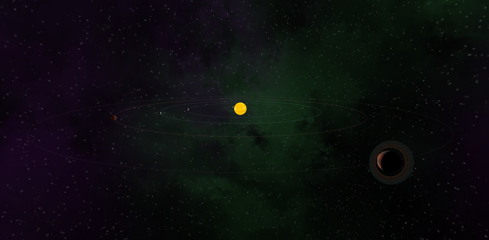
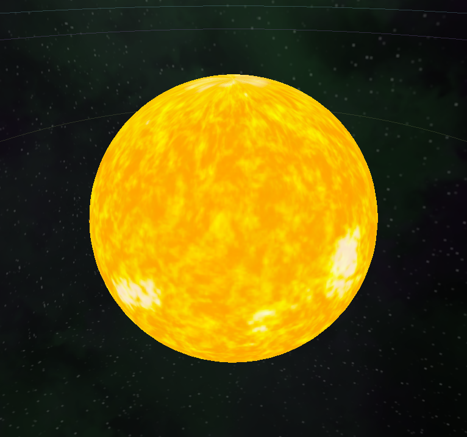
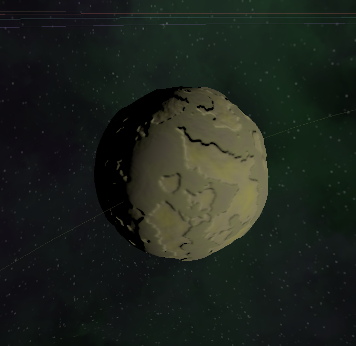
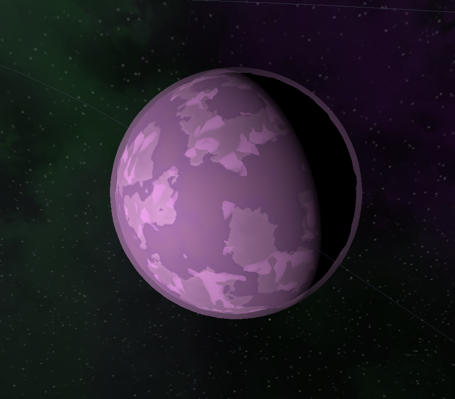
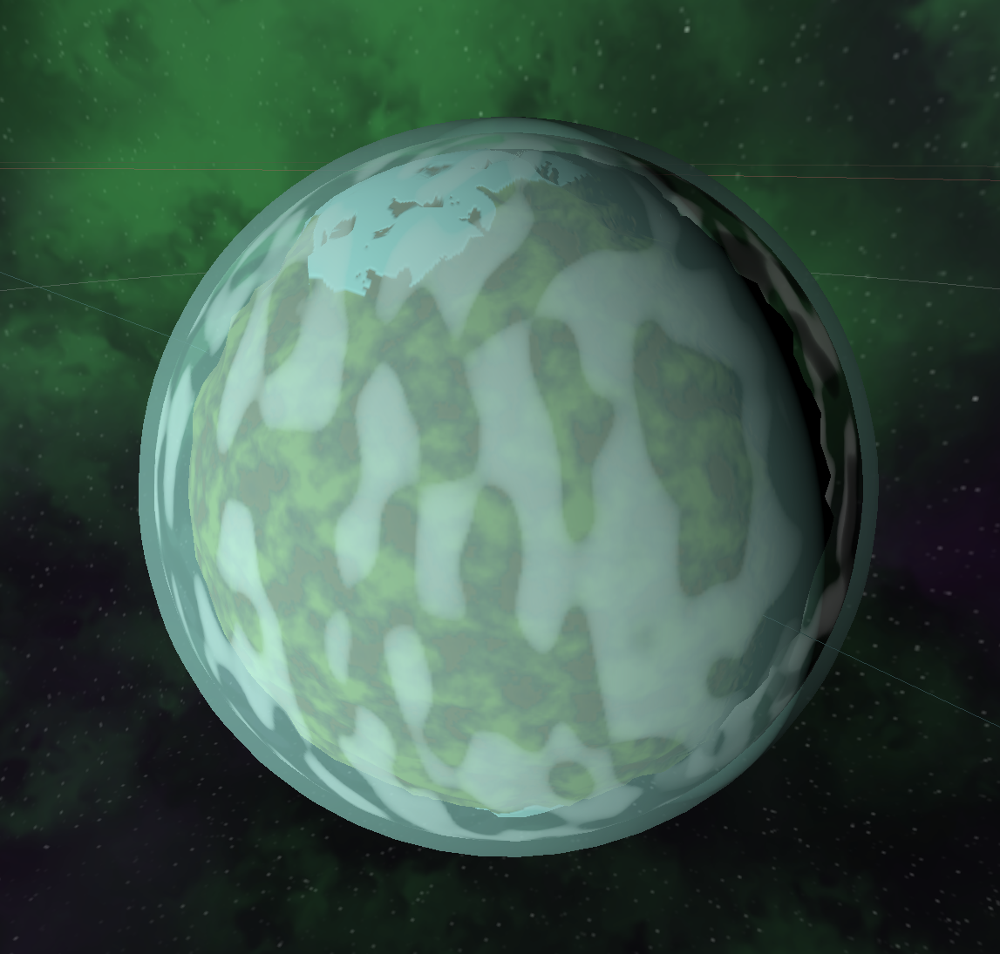
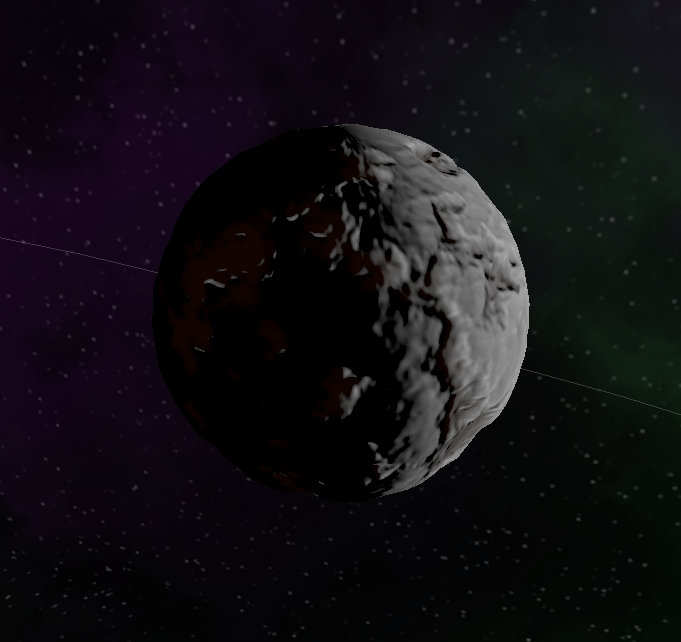
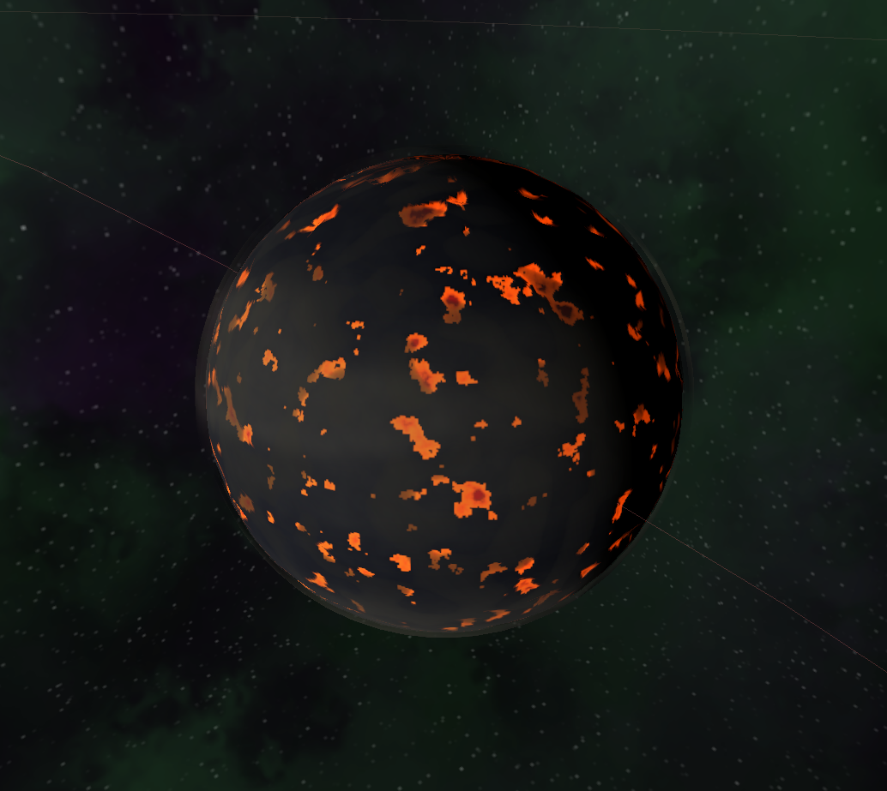
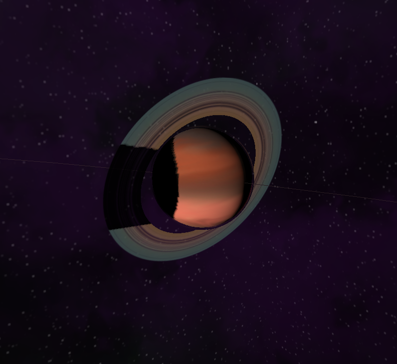
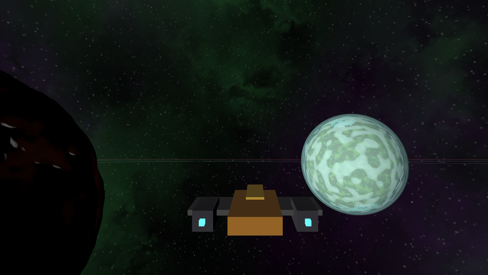

# Explorador del Sistema Nil

  

  
  

## Resumen del proyecto

El **Explorador del Sistema Nil** consiste en una simulación interactiva de un sistema planetario ficticio denominado **Nil**. Permite visualizar cuerpos celestes, sus órbitas y la representación de materiales y atmósferas mediante mapas de textura implementada con Three.js.

## Desarrollo

Las texturas de color de los planetas se generaron inicialmente mediante un **generador procedimental de planetas**[^1]. A partir de estas texturas base se obtuvieron los mapas adicionales necesarios para el material -mapa normal, mapa de desplazamiento, mapa de oclusión ambiental y mapa especular- utilizando una herramienta para generar mapas normales y derivados[^2].

Los materiales de superficie se implementaron con un modelo PBR estándar (`MeshStandardMaterial` en Three.js)[^6], aplicando los distintos mapas para obtener la sensación de rugosidad, relieve y respuesta a la iluminación. El procedimiento para obtener las texturas fue:

1. Generación de la textura de color (base)[^1].
2. Creación del resto de texturas (normal, desplazamiento, oclusión, especular) a partir de la textura base[^2].
3. Configuración del material PBR y ajuste de parámetros (roughness, metalness, displacementScale).
4. Integración en la escena y ajuste de la iluminación y sombras.

El código fuente y ejemplos interactivos pueden consultarse en el [**Repositorio de CodeSandbox**](https://codesandbox.io/p/sandbox/jfjt4p)[^5].

## Astros del Sistema Nil

### Estrella Nil

La estrella central, denominada **Nil**, actúa como fuente principal de iluminación en la escena. En la implementación se modeló la esfera estelar como un objeto con material emisivo y se añadió una **luz puntual (PointLight)** que produce iluminación direccional y sombras configuradas mediante parámetros de bias y tamaño del mapa de sombras[^7]. La configuración de la luz y de los parámetros de sombra se ajustó para evitar artefactos y mejorar la fidelidad visual.

> "La estrella Nil es una estrella de tipo G similar al Sol, pero ligeramente más caliente y brillante. Se formó hace unos 4.6 mil millones de años a partir de una nube de gas y polvo intergaláctico, probablemente originada por una supernova. Su energía sustenta todo el sistema, y se estima que aún tiene unos 3 mil millones de años antes de entrar en su fase de gigante roja."

La textura inicial de la esfera se obtuvo de la fuente indicada en las referencias[^4].

### Meruta

El planeta Meruta se modeló como una única esfera con material PBR (`MeshStandardMaterial`)[^6], aplicando mapas de color, normal, desplazamiento, oclusión y especular para definir su apariencia superficial.

> "Meruta es el planeta más cercano a Nil. Debido a su proximidad extrema a la estrella, ha perdido toda su atmósfera y su superficie es un vasto campo de cañones volcánicos y llanuras de roca expuesta. Su temperatura superficial es extremadamente alta, y su terreno se caracteriza por grandes cañones erosionados por intensas tormentas solares."

### Vandenia

Vandenia se construyó a partir de tres esferas concéntricas: una esfera opaca que constituye la superficie sólida (material PBR) y dos capas transparentes superiores. La primera capa transparente incorpora una textura para colorear la atmósfera y la segunda capa simula la capa de nubes, situada próxima a la superficie para lograr profundidad visual.

> "Vandenia es un planeta terrestre, con una atmósfera extremadamente densa compuesta principalmente de dióxido de azufre y gases venenosos. La superficie está cubierta por mares de ácido, grandes formaciones montañosas y volcanes activos. La temperatura es extremadamente alta debido a su atmósfera espesa y la proximidad a Nil."

### Ephichi

Ephichi emplea una estructura de capas análoga a la de Vandenia; adicionalmente cuenta con una luna, Kepro, que orbita en torno a él.

> "Ephichi es un planeta rocoso de gran tamaño con una atmósfera densa y cargada de dióxido de azufre, nitrógeno y otros gases pesados. No tiene agua, y la superficie está dominada por cadenas montañosas y valles erosionados. Las nubes grises y densas ocultan casi todo lo que hay en la superficie, haciendo que las condiciones sean extremadamente inhóspitas para la vida."

### Kepro

La luna Kepro se modeló con un conjunto de mapas similar al de los planetas; además se añadió un **mapa de emisión** para simular regiones calientes que permanecen brillantes incluso en las zonas de sombra.

> "Kepro es la luna rocosa que orbita el planeta Ephichi. Con una atmósfera casi nula, su superficie está dominada por vastos mares de lava solidificada y enormes montañas de basalto formadas por la actividad volcánica interna. La falta de atmósfera impide la retención de calor, lo que da lugar a temperaturas superficiales moderadas a pesar de su proximidad a Ephichi. A menudo, la superficie de Kepro está iluminada por destellos de erupciones volcánicas, creando un espectáculo dramático en sus cielos oscuros."

### Votustea

Votustea se creó reutilizando la técnica aplicada en Vandenia, con capas de atmósfera y varias capas de nubes para aumentar la sensación de dinámica atmosférica. Se incorporó asimismo un mapa de emisión para representar puntos iluminados en las sombras, similar al tratamiento aplicado en Kepro.

> "Votustea es un planeta rocoso aún en formación, con gran actividad volcánica visible desde el espacio. Su superficie está cubierta por enormes lagos de lava y porosos campos volcánicos, y su atmósfera está dominada por densas nubes de ceniza y gases tóxicos. El planeta está en una fase de formación y se estima que pasará varios millones de años más antes de ser completamente estable."

### Deanov

Para representar los anillos de Deanov se empleó `RingGeometry`[^8] y una textura derivada de nubes/gas que se aplica tanto a los anillos como a la superficie del planeta. Adicionalmente se superpusieron tres capas de nubes para acentuar el movimiento aparente en la atmósfera.

> "Deanov es un gigantesco planeta gaseoso, con una atmósfera densa compuesta principalmente de hidrógeno y helio. Su núcleo es posiblemente un gigante líquido, mientras que su atmósfera está llena de tormentas intensas. Deanov tiene anillos débiles formados por partículas de hielo y polvo que hacen que sea un espectáculo visual impresionante desde el espacio."

## Configuración orbital y dinámica

Los objetos del sistema se ubican mayoritariamente sobre un mismo plano orbital para favorecer la aparición de eclipses y fenómenos de ocultación. Algunas órbitas fueron definidas con sentido **prógrado** y otras con sentido **retrógrado**[^13]. Las trayectorias y velocidades angulares se parametrizan en el motor de simulación para controlar estabilidad y frecuencia de interacciones.

## Interfaz de usuario

La interfaz presenta dos paneles principales:

* **Panel izquierdo:** muestra información detallada del astro señalado por el cursor (nombre, parámetros orbitales, propiedades físicas y materiales).
* **Panel derecho:** permite alternar entre dos modos de control:

  1. **Control orbital:** cámara y controles centrados en órbitas alrededor del astro seleccionado.
  2. **Control libre (tercera persona):** control de una nave que permite desplazamiento libre por la escena.

La primera implementación para la nave fue un modelo `gltf` importado; debido a problemas con las texturas se decidió realizar el modelado a partir de cubos o `BoxGeometry`[^12].

## Uso de inteligencia artificial generativa

Se utilizó IA generativa para tareas puntuales:

* Generación de descripciones narrativas de los planetas.
* Obtención de ejemplos y fragmentos de código para resolver problemas concretos con Three.js.
* Corrección y formalización del texto del README.

## Recursos y referencias

Las siguientes referencias incluyen las herramientas, generadores y documentación consultada o citada en el proyecto.

[^1]: Generador procedural de planetas - [https://manny0.itch.io/planet-generator-2](https://manny0.itch.io/planet-generator-2)

[^2]: Generador de mapas normales, desplazamiento y especular - [https://cpetry.github.io/NormalMap-Online/](https://cpetry.github.io/NormalMap-Online/)

[^3]: Generador de nombres de planetas - [https://www.fantasynamegenerators.com/planet-names.php](https://www.fantasynamegenerators.com/planet-names.php)

[^4]: Textura de la estrella Nil (Sun textures) - [https://planetpixelemporium.com/sun.html](https://planetpixelemporium.com/sun.html)

[^5]: Repositorio/ejemplo en CodeSandbox - [https://codesandbox.io/p/sandbox/jfjt4p](https://codesandbox.io/p/sandbox/jfjt4p)

[^6]: `MeshStandardMaterial` (Three.js docs) - [https://threejs.org/docs/#api/en/materials/MeshStandardMaterial](https://threejs.org/docs/#api/en/materials/MeshStandardMaterial)

[^7]: `PointLight` y parámetros de sombras (Three.js docs) - [https://threejs.org/docs/#api/en/lights/PointLight](https://threejs.org/docs/#api/en/lights/PointLight)

[^8]: `RingGeometry` (Three.js docs) - [https://threejs.org/docs/#api/en/geometries/RingGeometry](https://threejs.org/docs/#api/en/geometries/RingGeometry)

[^9]: Guía: Creating a scene (Three.js manual) - [https://threejs.org/docs/#manual/en/introduction/Creating-a-scene](https://threejs.org/docs/#manual/en/introduction/Creating-a-scene)

[^10]: Three.js fundamentals - Primitives - [https://r105.threejsfundamentals.org/threejs/lessons/threejs-primitives.html](https://r105.threejsfundamentals.org/threejs/lessons/threejs-primitives.html)

[^11]: Textura de nubes/gas usada en anillos y superficie de Deanov - [https://ar.inspiredpencil.com/pictures-2023/gas-giant-texture](https://ar.inspiredpencil.com/pictures-2023/gas-giant-texture)

[^12]: `BoxGeometry` (Three.js docs) - [https://threejs.org/docs/?q=Box#api/en/geometries/BoxGeometry](https://threejs.org/docs/?q=Box#api/en/geometries/BoxGeometry)

[^13]: Movimientos retrógrado y prógrado - Wikipedia -[https://es.wikipedia.org/wiki/Movimientos_retr%C3%B3grado_y_pr%C3%B3grado](https://es.wikipedia.org/wiki/Movimientos_retr%C3%B3grado_y_pr%C3%B3grado)

---

Autor: Oliver Cabrera Volo

El contenido del repositorio (código y recursos propios) puede incluir archivos con licencias externas; se recomienda revisar las licencias de cada recurso listado en la sección de referencias antes de reutilizarlos en proyectos derivados.
